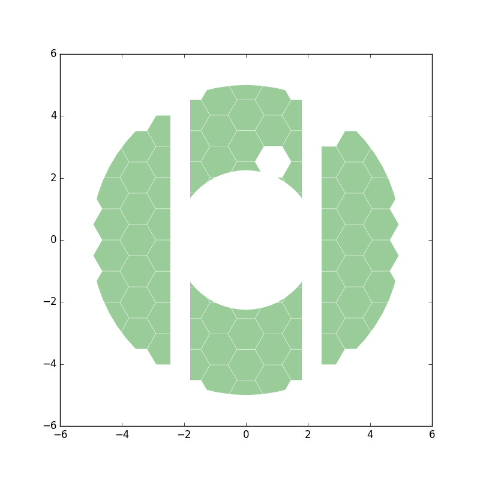
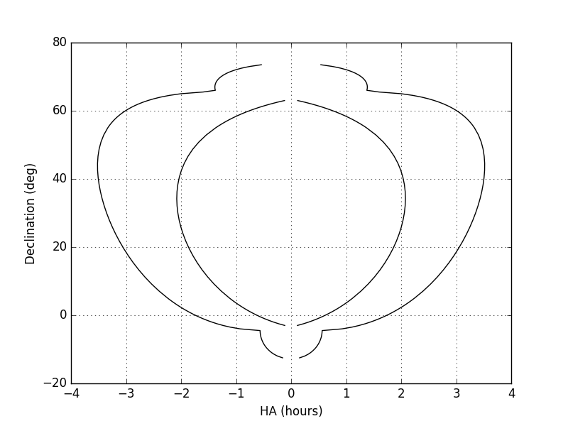
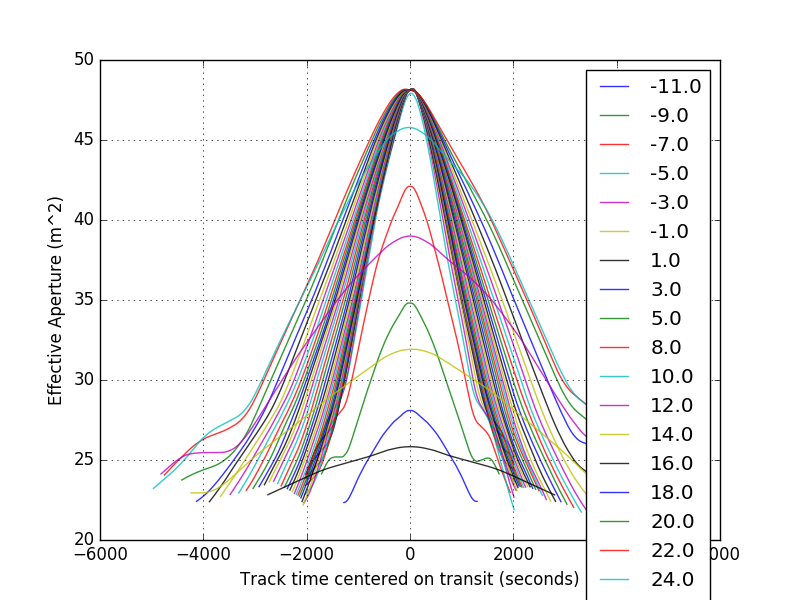

# pyHETobs
Package to calculate various HET, McDonald Observatory parameters for planning observations.

## Includes
+ Tools to calculate effective HET pupil accurately.
+ Tools to calculate track lengths, effective area for different target observations etc.
+ Tools to calculate the shadow the CCAS tower on the HET pupil

## How to use it
clone this module to local computer
`pip install -e /path/to/pyHETobs`

## Example plots

### HET pupil at transit

### HET target accesibility window

### HET effective area for different declintation targets

See `doc/` for more examples...
